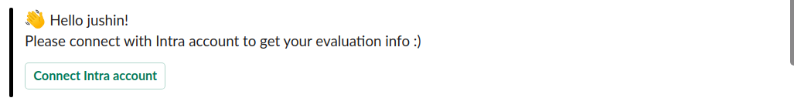
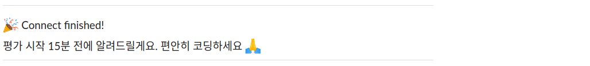
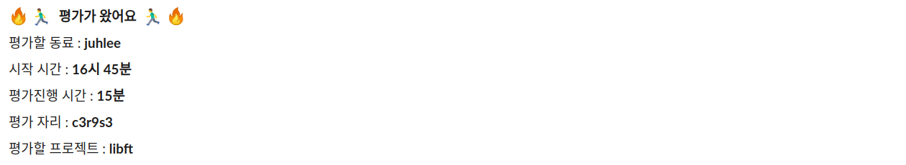
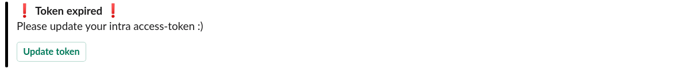
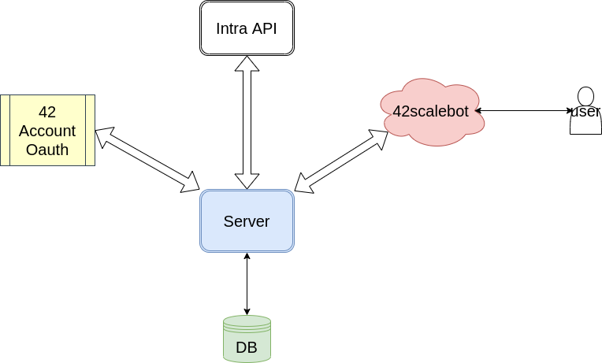
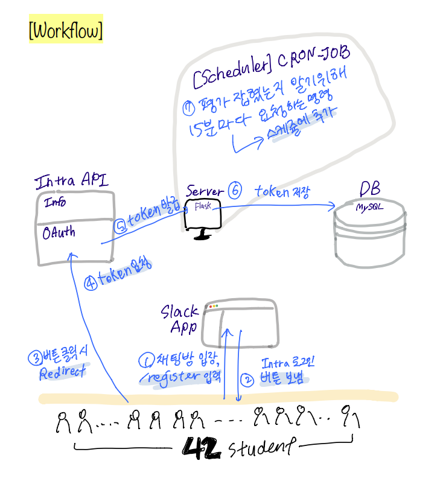
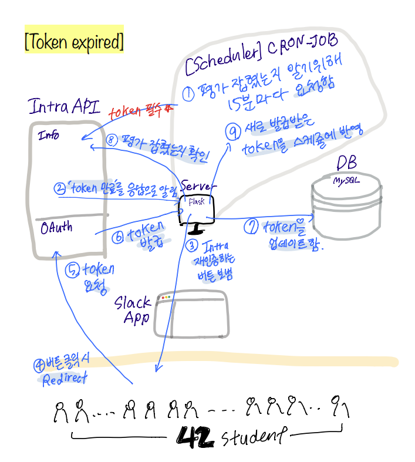

# 42scalebot [ 부제 : 혹시.. 어디세요? ]

#### 동료 평가 15분 전 평가할 동료의 정보를 슬랙으로 알려주는 봇이에요!🤖

#### 더이상 평가가 잡혔는지 확인하기 위해 intra 넷에 접속하지 않아도 돼요.

#### 그리고 평가로 만나게 된 서로에 대한 약속을 저버리는 일도 줄어들겠죠?


## > 기획 의도 /Intention of Project

평가 잡힌 사실을 모른채 다른 일에 집중하다 평가에 늦은 적도, 평가 해주시는 분이 평가를 잊으셔 정해진 평가 시간 보다 늦게 평가를 받은 적도 있어요.

평가가 잡혔는지 확인하기 위해 intra 넷을 새로고침 하던 과거를 잊고 싶어 기획하게 되었어요.


## > 시연 영상 링크

[42scale_bot 시연 영상](https://youtu.be/NIMVpoDA8C8)


## > 사용 방법 / Usage


1.  Workspace에 42seoul 이메일(```<your-id>@student.42seoul.kr```)로 참여하세요. 
(참여를 원하시는 분은 juhlee 또는 jushin에게 slack dm 보내주세요!)

2. 채팅 창에 ```/register```를 입력하세요.

3. 그러면 42scalebot이 다음과 같이 메시지를 보낼거에요!

   

4. 버튼을 누르고 Authorize를 클릭하고 완료되면 메시지가 올거에요.

   

5. 평가가 잡히면 평가 시작 15분 전에 평가할 동료에 대한 정보를 담은 메시지를 보내드릴게요!

   

6. 앗! 그러다가 Intra 토큰이 만료되면, 42scalebot이 알려드릴테니까 버튼만 눌러주세요 :)

   


## > 사용 대상 / Target User


42scalbot은 42 student를 위해 만들어졌어요.


 ## > 다이어그램 / Diagram




## > 작업 흐름 /  Workflow







## > 팀 소개 및 역할 분담 / Introducing our Team


- juhlee

  - slack app 담당
  - 데이터베이스 담당
  - 서버

- jushin

  - intra app 담당
  - 스케줄러 관련 코드 개발
  - 서버


## > 개발 환경 / Development Environment

- Language : python3, HTML, CSS

- Web Server : Flask

- Databse : MySQL


## > 협업 도구 / Collaboration Tools

- Slack

- Github

- Offline Meeting


## > 개발하며 배운 것들


```slack bot``` 	```oauth```	```cronjob``` 	```flask```	```mysql```	```sqlalchemy```	```utc/timestamp```

```transaction/session```	```html/css```	```API사용법``` 	```ngrok```


## > 참고 API / Using API Refrence


- slack API : https://api.slack.com/
- intra API : https://api.intra.42.fr/apidoc
